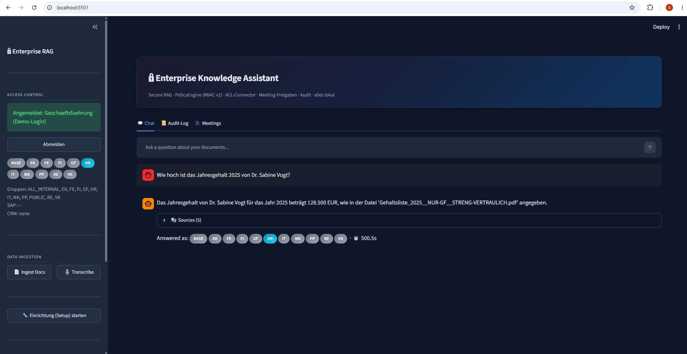

# EKA — On-Premise Enterprise-RAG mit echtem Berechtigungs-Trimming

Ein lokal laufender Wissens-Assistent für Unternehmen: er erschließt vorhandene
Firmendaten (Dateifreigaben, SQL-Datenbanken, Cloud-/Object-Storage, API-Exporte),
**übernimmt die bestehenden Zugriffsrechte deterministisch** (kein LLM für die
Rechte-Auswertung) und beantwortet Fragen pro angemeldetem Nutzer **nur mit dem, was
er sehen darf**. Alles läuft on-premise (Open-Source-LLM via Ollama, Embeddings lokal,
Vektor-DB Qdrant). Es verlassen keine Daten das Netz.

## Demo



*Pro Login werden nur die erlaubten Quellen beantwortet; nicht autorisierte Anfragen werden
verweigert (siehe `docs/screenshots/`).*

## Schnellstart (von Null)
```powershell
python -m venv venv; .\venv\Scripts\activate
python -m pip install -r requirements.txt
ollama pull qwen2.5:14b
python quickstart.py                 # erzeugt Demo-Firma, richtet alles ein, legt Logins an
$env:AUTH_ENABLED="true"; python -m streamlit run app.py
```
Eigene Daten statt Demo: `python quickstart.py --data-root C:\pfad\zur\firma`
— oder im Browser über **Sidebar → „ Einrichtung (Setup) starten"** (Ordner-Dialog).

## Architektur
- **Connectoren** (`connectors/`): `filesystem` (txt/md/pdf/docx), `sql` (generisch,
  beliebiger Connection-String + Tabellen-Whitelist), `s3` (S3-kompatibel), `api_dump`
  (JSON-API-Exporte mit inline-ACL). Jeder Treffer trägt seine Lesegruppen.
- **Deterministische ACL-Normalisierung** (`onboarding/acl_normalize.py`): liest die echten
  Berechtigungen aus den Quellen — DB-`_acl`-Tabellen und `.acl.json`-Sidecars in den
  Modellen **ActiveDirectory / SAP / SharePoint / POSIX / Inline** — und bildet jedes
  Prinzipal regelbasiert auf kanonische Gruppen ab. `_MANIFEST.csv` liefert Klassifizierung
  (ÖFFENTLICH→alle, INTERN→alle internen) und Lebenszyklus; veraltete/widerrufene Beschlüsse
  (`_WIDERRUFEN_`/`_VERALTET_`/…) werden nicht indexiert. **Kein LLM.**
- **PolicyEngine** (`policy.py`): einziger Durchsetzungspunkt, deny-by-default, fail-closed,
  Rollen-Vererbung, pro-Anfrage frisch (sofortiger Rechteentzug).
- **Authentifizierung** (`auth.py`): Login (scrypt-Hashes, HMAC-Sessions); pluggable
  Backend (lokal; OIDC/LDAP-Andockpunkt). Autorisierung bleibt in der PolicyEngine.
- **Onboarding** (`onboarding/`): `discovery` (Quellen erkennen), `governance_import` /
  `identity_infer` (Rollen+User aus Daten/Governance ableiten), `bootstrap` (App-Config
  schreiben), `landscape` (Manifest-Vertrag).
- **Abfrage** (`query.py`): ReAct-Agent mit gefilterten Tools; SQL über **drei** feste,
  parametrisierte Tools (`sql_list_tables`/`sql_lookup`/`sql_filter`) — skaliert auf
  hunderte Tabellen. Audit-Log (`audit.py`) protokolliert jede Allow/Deny-Entscheidung.
- **Beschluss-Historie** (`onboarding/decisions.py`): liest Meeting-Beschlüsse read-only
  zu Transparenz/Audit (werden bewusst NICHT automatisch auf Live-Rechte angewendet).
- **UI** (`app.py`): Chat / Audit-Log / Meetings + Setup-Assistent + Login.

## Sicherheit 
fail-closed · deny-by-default · sofortiger Rechteentzug · keine Daten verlassen das Netz ·
SQL nur parametrisiert + Whitelist (kein frei generiertes SQL) · Secrets nur aus der
Umgebung. Details: `SECURITY.md`.

## Tests
```bash
python -m pytest tests/ -q
```
Deckt PolicyEngine, SQL-Connector (Injection/Whitelist), ACL-Normalisierung (5 Modelle),
Onboarding/Identity, API-Dumps, Klassifizierung/Veraltet, Beschluss-Extraktor, Auth ab.

## Deployment
`deploy/` (Docker-Compose: Qdrant + Ollama + App; Installer) und `packaging/` (Windows-.exe
via PyInstaller). Siehe `ONBOARDING.md`, `AUTH.md`, `QUICKSTART.md`.

## Grenzen
Pilotreif/Demo-fähig, nicht „über Nacht für Konzerne fertig": LLM-Modell wird separat
bereitgestellt (nicht im .exe); echtes SSO (AD/OIDC) ist ein Andockpunkt, kein fertiger
Connector; abgeleitete Identitäten sind DRAFTs (in Produktion an AD/HR koppeln);
externer Pentest/Lasttest stehen aus. Beschluss-Lineage wird angezeigt, nicht
auto-angewendet (Sicherheit).

## Lizenz
PolyForm Noncommercial License 1.0.0 (siehe `LICENSE`) — frei einseh- und nutzbar fuer
nicht-kommerzielle Zwecke (Studium, Test, Forschung). Kommerzielle Nutzung nur durch den
Rechteinhaber. © 2026 tomg79.
